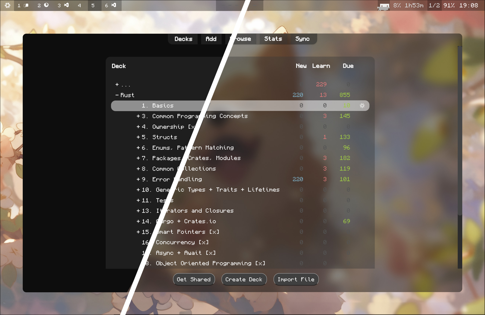

# AnkiBlur

This repo takes the official [Anki](https://github.com/ankitects/anki) and applies patches on top to achieve a window blur effect. This repo Automatically tracks and builds on each new Anki release.

<p align="center">
  
</p>

## Downloads

| Platform | Supported Architecture | Download Latest | Blur Support |
|---|---|---|---|
| |   |  | Requires a compositor implementing blur  |
|   |   | | Native blur support |
|  |  |  | Native blur support (Windows 8+) |


[comment]: <> () 
><strong>Note:</strong> AnkiBlur makes the window transparent and nudges your OS to draw blur. Only your operating system knows what's behind the window (like your wallpaper or other apps) and can therefore apply the blur effect to that background content. If you only see transparency without blur, im sorry :(


## Installation

### Linux

Every push builds three package formats per architecture (`x86_64` and `aarch64`)
in CI: a portable **AppImage**, a **.deb** (Debian/Ubuntu/Mint/Pop!_OS) and a
**.rpm** (Fedora/RHEL/openSUSE). Pick whichever fits your distro. They are
installed as `ankiblur`, so they sit side by side with a stock Anki.

> On first launch the launcher downloads the Python/Qt runtime into
> `~/.local/share/AnkiBlurProgramFiles/`, so the first start needs an internet
> connection and takes a little longer.

#### Option 1: AppImage (Recommended — works on any distro)
```bash
# Download the AppImage for your architecture, then:
chmod +x AnkiBlur-*-x86_64.AppImage
./AnkiBlur-*-x86_64.AppImage

# Optional: integrate with the system menu
./AnkiBlur-*-x86_64.AppImage --appimage-extract
sudo mv squashfs-root /opt/ankiblur
sudo ln -s /opt/ankiblur/AppRun /usr/local/bin/ankiblur
```

#### Option 2: Debian / Ubuntu (.deb)
```bash
sudo apt install ./ankiblur_*_amd64.deb     # arm64: ankiblur_*_arm64.deb
# or:  sudo dpkg -i ankiblur_*_amd64.deb && sudo apt install -f
```

#### Option 3: Fedora / openSUSE (.rpm)
```bash
sudo dnf install ./ankiblur-*.x86_64.rpm     # aarch64: ankiblur-*.aarch64.rpm
# openSUSE:  sudo zypper install ./ankiblur-*.x86_64.rpm
```

#### Option 4: Raw launcher tarball (other distros / Nix / manual)
```bash
# The architecture-specific .tar.zst is the plain Anki launcher payload.
tar --use-compress-program=unzstd -xf anki-launcher-linux-x86_64.tar.zst
cd anki-launcher-* && sudo ./install.sh   # or just ./anki to run in place
```

> **Flatpak** is not yet available: the launcher downloads its runtime at first
> start, which does not fit Flathub's offline-build model. A fully self-contained
> Flatpak is tracked as future work.

### macOS

#### Download and Install
```bash
# Download DMG
wget https://github.com/NullGates/AnkiBlur/releases/latest/download/anki-launcher-mac.dmg

# Mount and install
open anki-launcher-mac.dmg
# Drag AnkiBlur.app to Applications folder
```

#### Command Line (Homebrew - coming soon)
```bash
brew install --cask ankiblur
```

### Windows

#### Option 1: Installer (Recommended)
1. Download `anki-launcher-<version>-windows.exe` from [releases](https://github.com/NullGates/AnkiBlur/releases/latest)
2. Run the installer as Administrator
3. Follow installation wizard
4. Launch from Start Menu or Desktop shortcut

#### Option 2: Portable
1. Download `ankiblur-windows-x64-portable.zip`
2. Extract to desired folder
3. Run `ankiblur.exe` directly

#### Option 3: Package Managers
```powershell
# Chocolatey (coming soon)
choco install ankiblur

# Winget (coming soon)
winget install AnkiBlur
```

## FAQ

### General Questions

**Q: What's the difference between AnkiBlur and regular Anki?**
A: AnkiBlur is identical to Anki but with window transparency and blur effects. All Anki features work exactly the same.

**Q: Will my existing Anki data work with AnkiBlur?**
A: Yes! AnkiBlur uses the same data format and profile system as Anki. Your cards, decks, and settings are fully compatible.

**Q: Can I run both Anki and AnkiBlur on the same system?**
A: Yes, they can coexist. They use separate profile directories by default.

**Q: How do I sync my data between devices?**
A: Use AnkiWeb sync exactly like regular Anki. Your AnkiWeb account works with both.

### Installation Issues

**Q: The blur effect isn't working on Linux**
A: Blur effects require a compositor. Install one of these:
- **Wayland**: Sway, Hyprland, or GNOME (Mutter)
- **X11**: KWin (KDE), Compiz, or Picom

**Q: Getting "libEGL.so.1 not found" error on NixOS**
A: Use the NixOS-specific installation method or run with `nixGL`.

**Q: AppImage won't run - "Permission denied"**
A: Make it executable: `chmod +x ankiblur-*.AppImage`

**Q: macOS says "AnkiBlur.app is damaged"**
A: Right-click the app, select "Open", then click "Open" in the security dialog.

**Q: Windows Defender blocks the installer**
A: This is a false positive. Click "More info" → "Run anyway" or temporarily disable real-time protection.

### Performance & Features

**Q: Does AnkiBlur affect performance?**
A: Minimal impact. The blur effect uses hardware acceleration when available.

**Q: Can I adjust the transparency level?**
A: Yes — the background tint (color and alpha) is configurable through the bundled add-on's config (Tools → Add-ons → AnkiBlur Background Theme → Config).

**Q: Does AnkiBlur support add-ons?**
A: Yes! All Anki add-ons are fully compatible.

**Q: How do I update AnkiBlur?**
A: Download and install the latest version. Your data and settings are preserved.

### Troubleshooting

**Q: AnkiBlur crashes on startup**
A: Try these solutions:
1. Update your graphics drivers
2. Disable hardware acceleration: `ankiblur --disable-gpu`
3. Reset preferences: Delete `~/.local/share/ankiblur/prefs21.db`

**Q: Sync isn't working**
A: Check your internet connection and AnkiWeb credentials. Sync works identically to regular Anki.

**Q: Getting "Qt platform plugin" errors**
A: Install required Qt libraries:
- **Ubuntu/Debian**: `sudo apt install qt6-base-dev`
- **Fedora**: `sudo dnf install qt6-qtbase-devel`

**Q: How do I completely uninstall AnkiBlur?**
A:
- **Linux**: `sudo apt remove ankiblur` or delete AppImage
- **macOS**: Drag AnkiBlur.app to Trash
- **Windows**: Use "Add/Remove Programs" or run uninstaller
- **Data**: Delete `~/.local/share/ankiblur/` (Linux) or equivalent on other platforms

## How It Works

AnkiBlur is the official Anki launcher plus a bundled add-on — no Anki source
files are modified on your machine:

1. **Branding (build time)**: the launcher source is patched so the app
   presents itself as "AnkiBlur" and installs alongside stock Anki (I'm not
   allowed to post as "Anki", altough all credits goes to the ankitechts !).
2. **Bundled add-on (runtime)**: the entire blur/transparency payload ships as
   a regular Anki add-on (`ankiblur_background_theme`) embedded in the
   launcher binary and installed into your `addons21/` folder. At load time it
   uses only stable, supported Anki APIs (`gui_hooks`, `anki.hooks.wrap`,
   direct Qt calls) to:
   - make the main window translucent and ask the OS for native blur
     (macOS glass, Windows acrylic, your compositor's blur rules on Linux),
   - render the main webviews (card area, toolbars) on a transparent canvas
     with a configurable tint overlay.
3. **Self-check**: after startup the add-on verifies the effects actually
   applied and shows a warning inside Anki (once per Anki version) if an
   upstream change ever breaks them — nothing fails silently.

Because nothing is text-patched at runtime, AnkiBlur keeps working across Anki
point releases; a weekly CI probe additionally checks each new aqt release for
the handful of symbols the add-on relies on.


## License

AGPL-3.0 (same as Anki)
